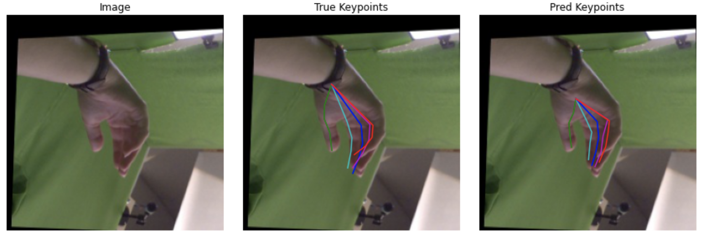

# 2D Hand Pose Estimation from RGB Image

## 1. Description
Repository includes working PyTorch pipeline to train a model and make inferences.

Here are my tutorials that explain it in details: 

- [Gentle introduction to 2D Hand Pose Estimation: Approach Explained](https://notrocketscience.blog/gentle-introduction-to-2d-hand-pose-estimation-approach-explained/)
- [Gentle introduction to 2D Hand Pose Estimation: Let's Code It!](https://notrocketscience.blog/gentle-introduction-to-2d-hand-pose-estimation-lets-code-it/)

For this project, open-source [FreiHAND](https://lmb.informatik.uni-freiburg.de/resources/datasets/FreihandDataset.en.html) dataset is used.

## 2. Repository Content

Repository has the following files:

- notebooks/Train Notebook.ipynb (notebook to train a model)
- notebooks/Inference Notebook.ipynb (notebook for inferences)
- utils/model.py (model class)
- utils/dataset.py (dataset class to load FreiHAND dataset)
- utils/trainer.py (class to train model)
- utils/prep_utils.py (supplementary functions)
- weights/model_final (trained model weights)
- requirements.txt (required packages & versions)

